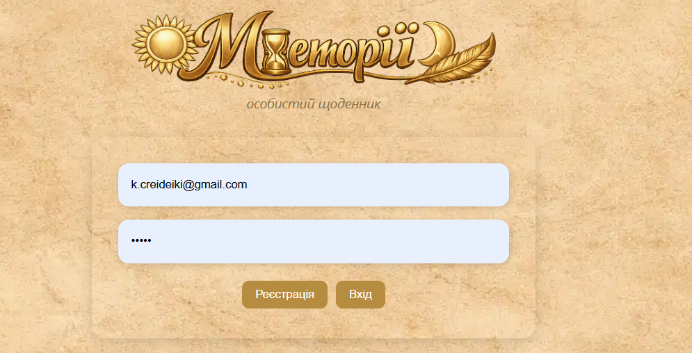
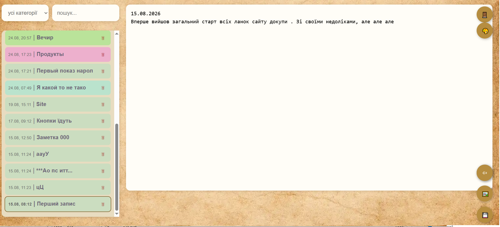
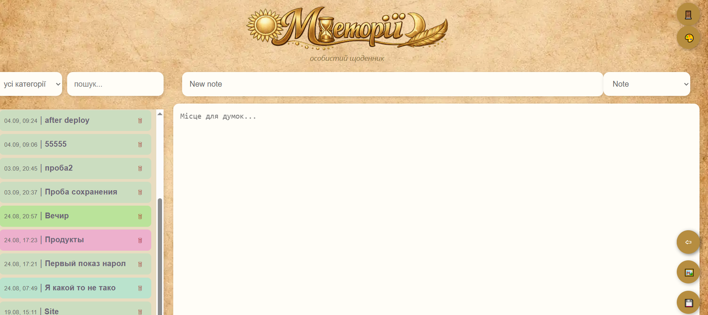
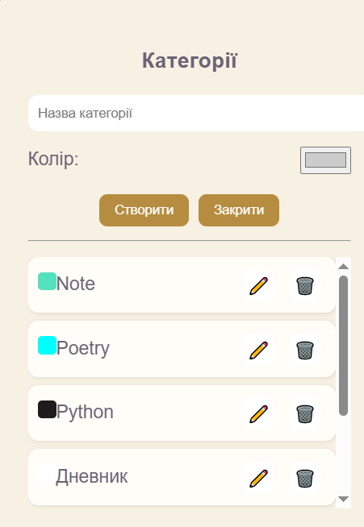
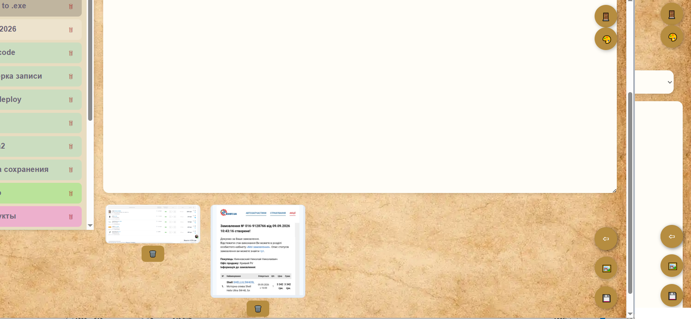
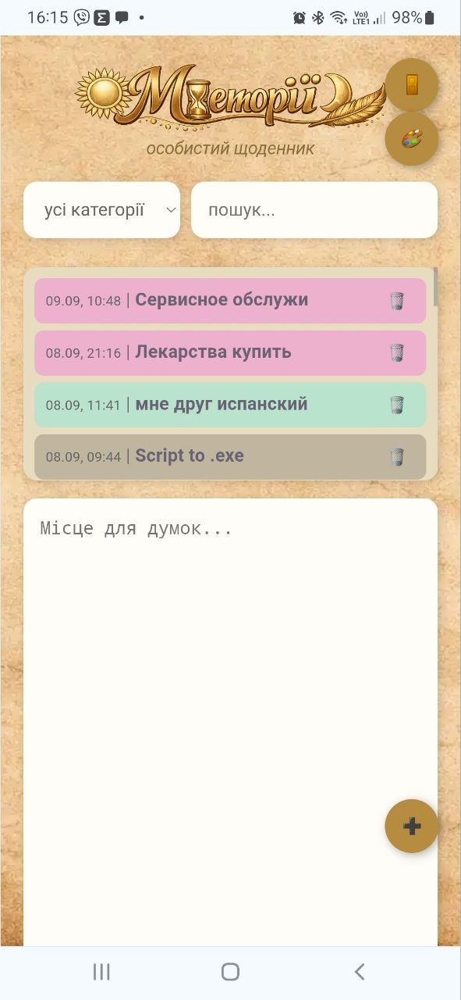

  

# 📝 Меморії (Memories) 

 

> Personal diary web application developed from scratch using React, Node.js, PostgreSQL and Cloudinary. 

 
> Personal diary application for storing memories, notes, photos, and life events. 

 


[](https://memoriipp/)


## 🌐 Live Demo 

 

https://memorii-gamma.vercel.app/ 

### 👉 https://memorii-gamma.vercel.app/ 

 

--- 

 

## 📖 About 

 

**Меморії (Memories)** is a personal diary and memory storage application designed to keep important life events, notes, photos, and experiences in one secure place. 

 

The application allows users to create, organize, edit, search, and manage their personal memories through a clean and mobile-friendly interface. 

 

--- 

 

## ✨ Features 

 

- ✅ User registration and login 

- ✅ JWT authentication 

- ✅ Create, edit and delete entries 

- ✅ Categories management 

- ✅ Multiple image uploads 

- ✅ Paste screenshots directly using Ctrl+V 

- ✅ Image gallery support 

- ✅ Search functionality 

- ✅ Responsive mobile interface 

- ✅ Secure image storage with Cloudinary 

- ✅ Data import/export 

- ✅ Personal memory archive management 

 

--- 

 

## 📷 Screenshots 

 
### Authorization Page


### View note


### Main Page create note


### Create category

 
### Screenshots,graphic file upload 

 
### Mobile Version 

 
--- 

 

## 🏗 Architecture 

 

```text 

┌─────────────────────┐ 

│ React + Vite │ 

│ Frontend │ 

└──────────┬──────────┘ 

 │ 

 ▼ 

┌─────────────────────┐ 

│ Express REST API │ 

│ Node.js Backend │ 

└───────┬─────┬───────┘ 

 │ │ 

 ▼ ▼ 

 

 PostgreSQL Cloudinary 

 (Neon) Images 

``` 

 

--- 

 

## 🛠 Tech Stack 

 

### Frontend 

 

- React 

- Vite 

- JavaScript 

- CSS 

 

### Backend 

 

- Node.js 

- Express 

 

### Database 

 

- PostgreSQL (Neon) 

 

### Authentication 

 

- JWT 

 

### Image Storage 

 

- Cloudinary 

 

### Deployment 

 

- Vercel 

- Render 

 

- 

 

Джерело: <https://m365.cloud.microsoft/chat/conversation/7d9f3a1b-382e-426f-9940-93ba6000cf66?fromcode=edgentp&redirectid=6a9a9fec36dd4be982f5ea4fd094cf9d&auth=2&handinClickTs=1788934660858>  

